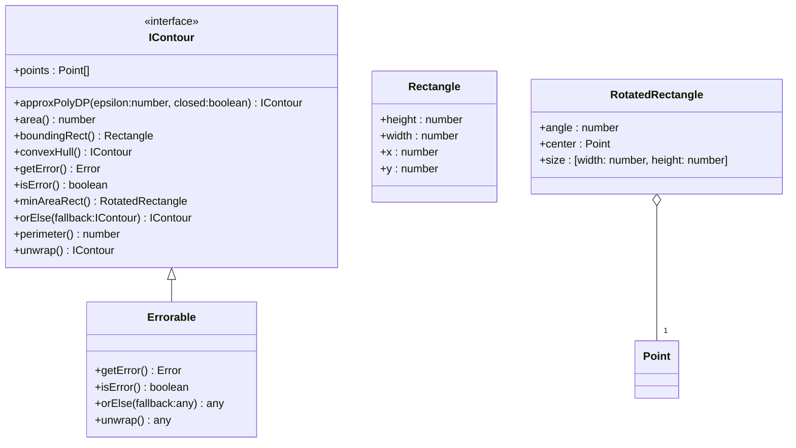

[**@ocrjs/infra-contract**](../README.md)

***

[@ocrjs/infra-contract](../README.md) / IContour

# Interface: IContour

Defined in: [interfaces/IContour.ts:8](https://github.com/SotaTne/ocrjs/blob/0b7f8fd574ea61267d8c3b63c1f0e7b7bba13fe0/packages/infra-contract/src/interfaces/IContour.ts#L8)

Contour representation for shape analysis.
Represents a continuous curve detected in an image.

## UML Class Diagram

## theme_extends

- [`Errorable`](../type-aliases/Errorable.md)\<`IContour`\>

## Properties

### points

> `readonly` **points**: readonly [`Point`](../type-aliases/Point.md)[]

Defined in: [interfaces/IContour.ts:12](https://github.com/SotaTne/ocrjs/blob/0b7f8fd574ea61267d8c3b63c1f0e7b7bba13fe0/packages/infra-contract/src/interfaces/IContour.ts#L12)

Points that make up the contour.

## Methods

### approxPolyDP()

> **approxPolyDP**(`epsilon`, `closed?`): `IContour`

Defined in: [interfaces/IContour.ts:40](https://github.com/SotaTne/ocrjs/blob/0b7f8fd574ea61267d8c3b63c1f0e7b7bba13fe0/packages/infra-contract/src/interfaces/IContour.ts#L40)

Approximate contour with fewer points.

#### Parameters

##### epsilon

`number`

Approximation accuracy (smaller = more accurate)

##### closed?

`boolean`

Whether the contour is closed

#### Returns

`IContour`

***

### area()

> **area**(): `number`

Defined in: [interfaces/IContour.ts:28](https://github.com/SotaTne/ocrjs/blob/0b7f8fd574ea61267d8c3b63c1f0e7b7bba13fe0/packages/infra-contract/src/interfaces/IContour.ts#L28)

Calculate contour area.

#### Returns

`number`

***

### boundingRect()

> **boundingRect**(): [`Rectangle`](../type-aliases/Rectangle.md)

Defined in: [interfaces/IContour.ts:17](https://github.com/SotaTne/ocrjs/blob/0b7f8fd574ea61267d8c3b63c1f0e7b7bba13fe0/packages/infra-contract/src/interfaces/IContour.ts#L17)

Get axis-aligned bounding rectangle.

#### Returns

[`Rectangle`](../type-aliases/Rectangle.md)

***

### convexHull()

> **convexHull**(): `IContour`

Defined in: [interfaces/IContour.ts:46](https://github.com/SotaTne/ocrjs/blob/0b7f8fd574ea61267d8c3b63c1f0e7b7bba13fe0/packages/infra-contract/src/interfaces/IContour.ts#L46)

Compute convex hull of the contour.
Returns the smallest convex polygon that contains all points.

#### Returns

`IContour`

***

### getError()

> **getError**(): `Error` \| `null`

Defined in: [types/Errorable.ts:8](https://github.com/SotaTne/ocrjs/blob/0b7f8fd574ea61267d8c3b63c1f0e7b7bba13fe0/packages/infra-contract/src/types/Errorable.ts#L8)

#### Returns

`Error` \| `null`

#### Inherited from

[`Errorable`](../type-aliases/Errorable.md).[`getError`](../type-aliases/Errorable.md#geterror)

***

### isError()

> **isError**(): `boolean`

Defined in: [types/Errorable.ts:7](https://github.com/SotaTne/ocrjs/blob/0b7f8fd574ea61267d8c3b63c1f0e7b7bba13fe0/packages/infra-contract/src/types/Errorable.ts#L7)

#### Returns

`boolean`

#### Inherited from

[`Errorable`](../type-aliases/Errorable.md).[`isError`](../type-aliases/Errorable.md#iserror)

***

### minAreaRect()

> **minAreaRect**(): [`RotatedRectangle`](../type-aliases/RotatedRectangle.md)

Defined in: [interfaces/IContour.ts:23](https://github.com/SotaTne/ocrjs/blob/0b7f8fd574ea61267d8c3b63c1f0e7b7bba13fe0/packages/infra-contract/src/interfaces/IContour.ts#L23)

Get minimum area rotated rectangle.
Useful for oriented text detection.

#### Returns

[`RotatedRectangle`](../type-aliases/RotatedRectangle.md)

***

### orElse()

> **orElse**(`fallback`): `IContour`

Defined in: [types/Errorable.ts:9](https://github.com/SotaTne/ocrjs/blob/0b7f8fd574ea61267d8c3b63c1f0e7b7bba13fe0/packages/infra-contract/src/types/Errorable.ts#L9)

#### Parameters

##### fallback

`IContour`

#### Returns

`IContour`

#### Inherited from

[`Errorable`](../type-aliases/Errorable.md).[`orElse`](../type-aliases/Errorable.md#orelse)

***

### perimeter()

> **perimeter**(): `number`

Defined in: [interfaces/IContour.ts:33](https://github.com/SotaTne/ocrjs/blob/0b7f8fd574ea61267d8c3b63c1f0e7b7bba13fe0/packages/infra-contract/src/interfaces/IContour.ts#L33)

Calculate contour perimeter (arc length).

#### Returns

`number`

***

### unwrap()

> **unwrap**(): `IContour`

Defined in: [types/Errorable.ts:10](https://github.com/SotaTne/ocrjs/blob/0b7f8fd574ea61267d8c3b63c1f0e7b7bba13fe0/packages/infra-contract/src/types/Errorable.ts#L10)

#### Returns

`IContour`

#### Inherited from

[`Errorable`](../type-aliases/Errorable.md).[`unwrap`](../type-aliases/Errorable.md#unwrap)
