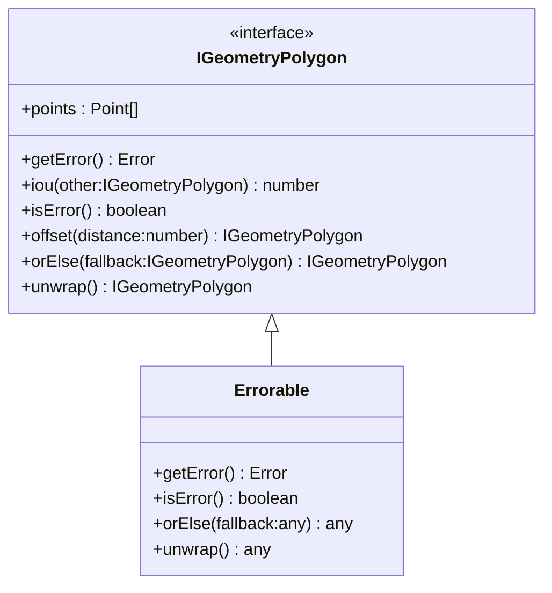

[**@ocrjs/infra-contract**](../README.md)

***

[@ocrjs/infra-contract](../README.md) / IGeometryPolygon

# Interface: IGeometryPolygon

Defined in: [interfaces/IGeometryPolygon.ts:10](https://github.com/SotaTne/ocrjs/blob/0b7f8fd574ea61267d8c3b63c1f0e7b7bba13fe0/packages/infra-contract/src/interfaces/IGeometryPolygon.ts#L10)

Polygon geometry interface
Extends Errorable for error handling
Methods like offset and iou may require complex geometry libraries

## UML Class Diagram

## theme_extends

- [`Errorable`](../type-aliases/Errorable.md)\<`IGeometryPolygon`\>

## Properties

### points

> `readonly` **points**: readonly [`Point`](../type-aliases/Point.md)[]

Defined in: [interfaces/IGeometryPolygon.ts:11](https://github.com/SotaTne/ocrjs/blob/0b7f8fd574ea61267d8c3b63c1f0e7b7bba13fe0/packages/infra-contract/src/interfaces/IGeometryPolygon.ts#L11)

## Methods

### getError()

> **getError**(): `Error` \| `null`

Defined in: [types/Errorable.ts:8](https://github.com/SotaTne/ocrjs/blob/0b7f8fd574ea61267d8c3b63c1f0e7b7bba13fe0/packages/infra-contract/src/types/Errorable.ts#L8)

#### Returns

`Error` \| `null`

#### Inherited from

[`Errorable`](../type-aliases/Errorable.md).[`getError`](../type-aliases/Errorable.md#geterror)

***

### iou()

> **iou**(`other`): `number`

Defined in: [interfaces/IGeometryPolygon.ts:25](https://github.com/SotaTne/ocrjs/blob/0b7f8fd574ea61267d8c3b63c1f0e7b7bba13fe0/packages/infra-contract/src/interfaces/IGeometryPolygon.ts#L25)

IoU calculation (requires Clipper)
Needs polygon intersection/union which is complex

#### Parameters

##### other

`IGeometryPolygon`

#### Returns

`number`

Intersection over Union value

#### Throws

Error if calculation fails

***

### isError()

> **isError**(): `boolean`

Defined in: [types/Errorable.ts:7](https://github.com/SotaTne/ocrjs/blob/0b7f8fd574ea61267d8c3b63c1f0e7b7bba13fe0/packages/infra-contract/src/types/Errorable.ts#L7)

#### Returns

`boolean`

#### Inherited from

[`Errorable`](../type-aliases/Errorable.md).[`isError`](../type-aliases/Errorable.md#iserror)

***

### offset()

> **offset**(`distance`): `IGeometryPolygon`

Defined in: [interfaces/IGeometryPolygon.ts:17](https://github.com/SotaTne/ocrjs/blob/0b7f8fd574ea61267d8c3b63c1f0e7b7bba13fe0/packages/infra-contract/src/interfaces/IGeometryPolygon.ts#L17)

Offset operation (requires Clipper)
Polygon offsetting is geometrically complex

#### Parameters

##### distance

`number`

#### Returns

`IGeometryPolygon`

***

### orElse()

> **orElse**(`fallback`): `IGeometryPolygon`

Defined in: [types/Errorable.ts:9](https://github.com/SotaTne/ocrjs/blob/0b7f8fd574ea61267d8c3b63c1f0e7b7bba13fe0/packages/infra-contract/src/types/Errorable.ts#L9)

#### Parameters

##### fallback

`IGeometryPolygon`

#### Returns

`IGeometryPolygon`

#### Inherited from

[`Errorable`](../type-aliases/Errorable.md).[`orElse`](../type-aliases/Errorable.md#orelse)

***

### unwrap()

> **unwrap**(): `IGeometryPolygon`

Defined in: [types/Errorable.ts:10](https://github.com/SotaTne/ocrjs/blob/0b7f8fd574ea61267d8c3b63c1f0e7b7bba13fe0/packages/infra-contract/src/types/Errorable.ts#L10)

#### Returns

`IGeometryPolygon`

#### Inherited from

[`Errorable`](../type-aliases/Errorable.md).[`unwrap`](../type-aliases/Errorable.md#unwrap)
