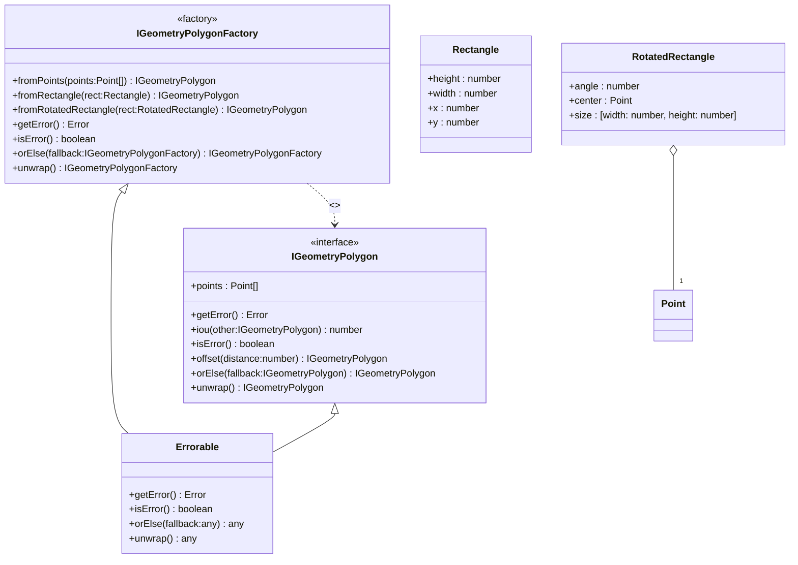

[**@ocrjs/infra-contract**](../README.md)

***

[@ocrjs/infra-contract](../README.md) / IGeometryPolygonFactory

# Interface: IGeometryPolygonFactory

Defined in: [interfaces/IGeometryPolygonFactory.ts:9](https://github.com/SotaTne/ocrjs/blob/0b7f8fd574ea61267d8c3b63c1f0e7b7bba13fe0/packages/infra-contract/src/interfaces/IGeometryPolygonFactory.ts#L9)

Factory interface for creating IGeometryPolygon instances.
Implementations provide concrete polygon creation logic.

## UML Class Diagram

## theme_extends

- [`Errorable`](../type-aliases/Errorable.md)\<`IGeometryPolygonFactory`\>

## Methods

### fromPoints()

> **fromPoints**(`points`): [`IGeometryPolygon`](IGeometryPolygon.md)

Defined in: [interfaces/IGeometryPolygonFactory.ts:15](https://github.com/SotaTne/ocrjs/blob/0b7f8fd574ea61267d8c3b63c1f0e7b7bba13fe0/packages/infra-contract/src/interfaces/IGeometryPolygonFactory.ts#L15)

Creates a polygon from an array of points.

#### Parameters

##### points

readonly [`Point`](../type-aliases/Point.md)[]

Array of points defining the polygon vertices

#### Returns

[`IGeometryPolygon`](IGeometryPolygon.md)

***

### fromRectangle()

> **fromRectangle**(`rect`): [`IGeometryPolygon`](IGeometryPolygon.md)

Defined in: [interfaces/IGeometryPolygonFactory.ts:21](https://github.com/SotaTne/ocrjs/blob/0b7f8fd574ea61267d8c3b63c1f0e7b7bba13fe0/packages/infra-contract/src/interfaces/IGeometryPolygonFactory.ts#L21)

Creates a rectangular polygon from a Rectangle.

#### Parameters

##### rect

[`Rectangle`](../type-aliases/Rectangle.md)

Rectangle definition

#### Returns

[`IGeometryPolygon`](IGeometryPolygon.md)

***

### fromRotatedRectangle()

> **fromRotatedRectangle**(`rect`): [`IGeometryPolygon`](IGeometryPolygon.md)

Defined in: [interfaces/IGeometryPolygonFactory.ts:27](https://github.com/SotaTne/ocrjs/blob/0b7f8fd574ea61267d8c3b63c1f0e7b7bba13fe0/packages/infra-contract/src/interfaces/IGeometryPolygonFactory.ts#L27)

Creates a polygon from a RotatedRectangle.

#### Parameters

##### rect

[`RotatedRectangle`](../type-aliases/RotatedRectangle.md)

Rotated rectangle definition

#### Returns

[`IGeometryPolygon`](IGeometryPolygon.md)

***

### getError()

> **getError**(): `Error` \| `null`

Defined in: [types/Errorable.ts:8](https://github.com/SotaTne/ocrjs/blob/0b7f8fd574ea61267d8c3b63c1f0e7b7bba13fe0/packages/infra-contract/src/types/Errorable.ts#L8)

#### Returns

`Error` \| `null`

#### Inherited from

[`Errorable`](../type-aliases/Errorable.md).[`getError`](../type-aliases/Errorable.md#geterror)

***

### isError()

> **isError**(): `boolean`

Defined in: [types/Errorable.ts:7](https://github.com/SotaTne/ocrjs/blob/0b7f8fd574ea61267d8c3b63c1f0e7b7bba13fe0/packages/infra-contract/src/types/Errorable.ts#L7)

#### Returns

`boolean`

#### Inherited from

[`Errorable`](../type-aliases/Errorable.md).[`isError`](../type-aliases/Errorable.md#iserror)

***

### orElse()

> **orElse**(`fallback`): `IGeometryPolygonFactory`

Defined in: [types/Errorable.ts:9](https://github.com/SotaTne/ocrjs/blob/0b7f8fd574ea61267d8c3b63c1f0e7b7bba13fe0/packages/infra-contract/src/types/Errorable.ts#L9)

#### Parameters

##### fallback

`IGeometryPolygonFactory`

#### Returns

`IGeometryPolygonFactory`

#### Inherited from

[`Errorable`](../type-aliases/Errorable.md).[`orElse`](../type-aliases/Errorable.md#orelse)

***

### unwrap()

> **unwrap**(): `IGeometryPolygonFactory`

Defined in: [types/Errorable.ts:10](https://github.com/SotaTne/ocrjs/blob/0b7f8fd574ea61267d8c3b63c1f0e7b7bba13fe0/packages/infra-contract/src/types/Errorable.ts#L10)

#### Returns

`IGeometryPolygonFactory`

#### Inherited from

[`Errorable`](../type-aliases/Errorable.md).[`unwrap`](../type-aliases/Errorable.md#unwrap)
