[**@ocrjs/infra-contract**](../README.md)

***

[@ocrjs/infra-contract](../README.md) / IImage

# Interface: IImage

Defined in: [interfaces/IImage.ts:24](https://github.com/SotaTne/ocrjs/blob/0b7f8fd574ea61267d8c3b63c1f0e7b7bba13fe0/packages/infra-contract/src/interfaces/IImage.ts#L24)

Image representation independent of underlying implementation.
Can be backed by cv.Mat (OpenCV), Canvas, or other formats.

This interface follows the same principles as ITensor - it's a handle
to image data that may reside in different backends (CPU, GPU, WebGL).

## UML Class Diagram

```mermaid
classDiagram
class IImage {
  <<interface>>
  +channels : number
  +colorSpace : ColorSpace
  +height : number
  +width : number
  +adaptiveThreshold(maxValue:number, method:AdaptiveThresholdMethod, blockSize:number, C:number) IImage
  +bilateralFilter(d:number, sigmaColor:number, sigmaSpace:number) IImage
  +blur(kernelSize:number) IImage
  +canny(threshold1:number, threshold2:number) IImage
  +clone() IImage
  +connectedComponents() any
  +convertTo(target:ColorSpace) IImage
  +crop(rect:Rectangle) IImage
  +cropPolygon(polygon:Point[]) IImage
  +dilate(kernelSize:number, iterations:number) IImage
}
class Errorable {
  +getError() Error
  +isError() boolean
  +orElse(fallback:any) any
  +unwrap() any
}
class ColorSpace
class AdaptiveThresholdMethod
class Rectangle {
  +height : number
  +width : number
  +x : number
  +y : number
}
class IContour {
  <<interface>>
  +points : Point[]
  +approxPolyDP(epsilon:number, closed:boolean) IContour
  +area() number
  +boundingRect() Rectangle
  +convexHull() IContour
  +getError() Error
  +isError() boolean
  +minAreaRect() RotatedRectangle
  +orElse(fallback:IContour) IContour
  +perimeter() number
  +unwrap() IContour
}
class BorderType
class InterpolationMethod
class Point
class ThresholdType
class TensorLayout
class DType
class ITensor {
  <<interface>>
  +dtype : DType
  +shape : number[]
  +add(other:ITensor) ITensor
  +argmax(axis:number, keepDims:boolean) ITensor
  +broadcastTo(shape:number[]) ITensor
  +cast(dtype:DType) ITensor
  +clip(min:number, max:number) ITensor
  +concat(others:ITensor[], axis:number) ITensor
  +dispose() ITensor
  +div(other:ITensor) ITensor
  +getError() Error
  +isError() boolean
}
class AffineTransformMatrix
class RotatedRectangle {
  +angle : number
  +center : Point
  +size : [width: number, height: number]
}

IImage <|-- Errorable
IImage *-- "1" ColorSpace
IContour <|-- Errorable
ITensor <|-- Errorable
ITensor *-- "1" DType
RotatedRectangle o-- "1" Point

click IImage href "interfaces/IImage.html" "View IImage documentation"
click Errorable href "types/Errorable.html" "View Errorable documentation"
click ColorSpace href "types/ColorSpace.html" "View ColorSpace documentation"
click AdaptiveThresholdMethod href "types/AdaptiveThresholdMethod.html" "View AdaptiveThresholdMethod documentation"
click Rectangle href "types/Rectangle.html" "View Rectangle documentation"
click IContour href "interfaces/IContour.html" "View IContour documentation"
click BorderType href "types/BorderType.html" "View BorderType documentation"
click InterpolationMethod href "types/InterpolationMethod.html" "View InterpolationMethod documentation"
click Point href "types/Point.html" "View Point documentation"
click ThresholdType href "types/ThresholdType.html" "View ThresholdType documentation"
click TensorLayout href "types/TensorLayout.html" "View TensorLayout documentation"
click DType href "types/DType.html" "View DType documentation"
click ITensor href "interfaces/ITensor.html" "View ITensor documentation"
click AffineTransformMatrix href "types/AffineTransformMatrix.html" "View AffineTransformMatrix documentation"
click RotatedRectangle href "types/RotatedRectangle.html" "View RotatedRectangle documentation"
```



## theme_extends

- [`Errorable`](../type-aliases/Errorable.md)\<`IImage`\>

## Properties

### channels

> `readonly` **channels**: `number`

Defined in: [interfaces/IImage.ts:41](https://github.com/SotaTne/ocrjs/blob/0b7f8fd574ea61267d8c3b63c1f0e7b7bba13fe0/packages/infra-contract/src/interfaces/IImage.ts#L41)

Number of channels.
- 1: Grayscale
- 3: RGB
- 4: RGBA

***

### colorSpace

> `readonly` **colorSpace**: [`ColorSpace`](../type-aliases/ColorSpace.md)

Defined in: [interfaces/IImage.ts:43](https://github.com/SotaTne/ocrjs/blob/0b7f8fd574ea61267d8c3b63c1f0e7b7bba13fe0/packages/infra-contract/src/interfaces/IImage.ts#L43)

***

### height

> `readonly` **height**: `number`

Defined in: [interfaces/IImage.ts:33](https://github.com/SotaTne/ocrjs/blob/0b7f8fd574ea61267d8c3b63c1f0e7b7bba13fe0/packages/infra-contract/src/interfaces/IImage.ts#L33)

Image height in pixels.

***

### width

> `readonly` **width**: `number`

Defined in: [interfaces/IImage.ts:28](https://github.com/SotaTne/ocrjs/blob/0b7f8fd574ea61267d8c3b63c1f0e7b7bba13fe0/packages/infra-contract/src/interfaces/IImage.ts#L28)

Image width in pixels.

## Methods

### adaptiveThreshold()

> **adaptiveThreshold**(`maxValue`, `method`, `blockSize`, `C`): `IImage`

Defined in: [interfaces/IImage.ts:95](https://github.com/SotaTne/ocrjs/blob/0b7f8fd574ea61267d8c3b63c1f0e7b7bba13fe0/packages/infra-contract/src/interfaces/IImage.ts#L95)

Apply adaptive threshold.
Better than simple threshold for images with varying illumination.

#### Parameters

##### maxValue

`number`

Maximum value for thresholded pixels

##### method

[`AdaptiveThresholdMethod`](../type-aliases/AdaptiveThresholdMethod.md)

Adaptive method ('mean' or 'gaussian')

##### blockSize

`number`

Size of pixel neighborhood (must be odd)

##### C

`number`

Constant subtracted from mean/weighted mean

#### Returns

`IImage`

***

### bilateralFilter()

> **bilateralFilter**(`d`, `sigmaColor`, `sigmaSpace`): `IImage`

Defined in: [interfaces/IImage.ts:136](https://github.com/SotaTne/ocrjs/blob/0b7f8fd574ea61267d8c3b63c1f0e7b7bba13fe0/packages/infra-contract/src/interfaces/IImage.ts#L136)

Apply bilateral filter (edge-preserving smoothing).

#### Parameters

##### d

`number`

Diameter of pixel neighborhood

##### sigmaColor

`number`

Filter sigma in color space

##### sigmaSpace

`number`

Filter sigma in coordinate space

#### Returns

`IImage`

***

### blur()

> **blur**(`kernelSize`): `IImage`

Defined in: [interfaces/IImage.ts:142](https://github.com/SotaTne/ocrjs/blob/0b7f8fd574ea61267d8c3b63c1f0e7b7bba13fe0/packages/infra-contract/src/interfaces/IImage.ts#L142)

Apply simple averaging blur.

#### Parameters

##### kernelSize

`number`

Size of the kernel

#### Returns

`IImage`

***

### canny()

> **canny**(`threshold1`, `threshold2`): `IImage`

Defined in: [interfaces/IImage.ts:251](https://github.com/SotaTne/ocrjs/blob/0b7f8fd574ea61267d8c3b63c1f0e7b7bba13fe0/packages/infra-contract/src/interfaces/IImage.ts#L251)

Detect edges using Canny edge detector.

#### Parameters

##### threshold1

`number`

First threshold for hysteresis

##### threshold2

`number`

Second threshold for hysteresis

#### Returns

`IImage`

***

### clone()

> **clone**(): `IImage`

Defined in: [interfaces/IImage.ts:307](https://github.com/SotaTne/ocrjs/blob/0b7f8fd574ea61267d8c3b63c1f0e7b7bba13fe0/packages/infra-contract/src/interfaces/IImage.ts#L307)

Clone the image (create a copy).

#### Returns

`IImage`

***

### connectedComponents()

> **connectedComponents**(): `object`

Defined in: [interfaces/IImage.ts:207](https://github.com/SotaTne/ocrjs/blob/0b7f8fd574ea61267d8c3b63c1f0e7b7bba13fe0/packages/infra-contract/src/interfaces/IImage.ts#L207)

Label connected components in binary image.

#### Returns

`object`

Object with labels (IImage) and count (number of components)

##### count

> **count**: `number`

##### labels

> **labels**: `IImage`

***

### convertTo()

> **convertTo**(`target`): `IImage`

Defined in: [interfaces/IImage.ts:68](https://github.com/SotaTne/ocrjs/blob/0b7f8fd574ea61267d8c3b63c1f0e7b7bba13fe0/packages/infra-contract/src/interfaces/IImage.ts#L68)

Convert to a different color space.
Source color space is automatically determined from the current colorSpace property.

#### Parameters

##### target

[`ColorSpace`](../type-aliases/ColorSpace.md)

Target color space

#### Returns

`IImage`

#### Example

```typescript
const rgb = bgrImage.convertTo('RGB');  // BGR -> RGB
const gray = rgbImage.convertTo('GRAY'); // RGB -> GRAY
const bgr = grayImage.convertTo('BGR');  // GRAY -> BGR
```

***

### crop()

> **crop**(`rect`): `IImage`

Defined in: [interfaces/IImage.ts:153](https://github.com/SotaTne/ocrjs/blob/0b7f8fd574ea61267d8c3b63c1f0e7b7bba13fe0/packages/infra-contract/src/interfaces/IImage.ts#L153)

Crop image by axis-aligned rectangle.

#### Parameters

##### rect

[`Rectangle`](../type-aliases/Rectangle.md)

Rectangle to crop

#### Returns

`IImage`

***

### cropPolygon()

> **cropPolygon**(`polygon`): `IImage`

Defined in: [interfaces/IImage.ts:161](https://github.com/SotaTne/ocrjs/blob/0b7f8fd574ea61267d8c3b63c1f0e7b7bba13fe0/packages/infra-contract/src/interfaces/IImage.ts#L161)

Crop image by polygon (with perspective transform).
Useful for extracting rotated text regions.

#### Parameters

##### polygon

readonly [`Point`](../type-aliases/Point.md)[]

Points defining the polygon (at least 4 points)

#### Returns

`IImage`

Cropped and perspective-corrected image

***

### dilate()

> **dilate**(`kernelSize`, `iterations?`): `IImage`

Defined in: [interfaces/IImage.ts:214](https://github.com/SotaTne/ocrjs/blob/0b7f8fd574ea61267d8c3b63c1f0e7b7bba13fe0/packages/infra-contract/src/interfaces/IImage.ts#L214)

Apply morphological dilation.

#### Parameters

##### kernelSize

`number`

Size of the structuring element

##### iterations?

`number`

Number of times dilation is applied (default 1)

#### Returns

`IImage`

***

### dispose()

> **dispose**(): `IImage`

Defined in: [interfaces/IImage.ts:312](https://github.com/SotaTne/ocrjs/blob/0b7f8fd574ea61267d8c3b63c1f0e7b7bba13fe0/packages/infra-contract/src/interfaces/IImage.ts#L312)

Clean up resources (GPU buffers, memory).

#### Returns

`IImage`

***

### drawContours()

> **drawContours**(`contours`, `color`, `thickness?`): `IImage`

Defined in: [interfaces/IImage.ts:197](https://github.com/SotaTne/ocrjs/blob/0b7f8fd574ea61267d8c3b63c1f0e7b7bba13fe0/packages/infra-contract/src/interfaces/IImage.ts#L197)

Draw contours on image.

#### Parameters

##### contours

readonly [`IContour`](IContour.md)[]

Contours to draw

##### color

Color value (grayscale or [R, G, B])

`number` | readonly \[`number`, `number`, `number`\]

##### thickness?

`number`

Line thickness (-1 for filled)

#### Returns

`IImage`

***

### erode()

> **erode**(`kernelSize`, `iterations?`): `IImage`

Defined in: [interfaces/IImage.ts:221](https://github.com/SotaTne/ocrjs/blob/0b7f8fd574ea61267d8c3b63c1f0e7b7bba13fe0/packages/infra-contract/src/interfaces/IImage.ts#L221)

Apply morphological erosion.

#### Parameters

##### kernelSize

`number`

Size of the structuring element

##### iterations?

`number`

Number of times erosion is applied (default 1)

#### Returns

`IImage`

***

### findContours()

> **findContours**(): [`IContour`](IContour.md)[]

Defined in: [interfaces/IImage.ts:189](https://github.com/SotaTne/ocrjs/blob/0b7f8fd574ea61267d8c3b63c1f0e7b7bba13fe0/packages/infra-contract/src/interfaces/IImage.ts#L189)

Find contours in binary image.
Image should be binary (thresholded) before calling this.

#### Returns

[`IContour`](IContour.md)[]

Array of detected contours

#### Throws

Error if the image is not single-channel binary

***

### gaussianBlur()

> **gaussianBlur**(`kernelSize`, `sigma?`): `IImage`

Defined in: [interfaces/IImage.ts:122](https://github.com/SotaTne/ocrjs/blob/0b7f8fd574ea61267d8c3b63c1f0e7b7bba13fe0/packages/infra-contract/src/interfaces/IImage.ts#L122)

Apply Gaussian blur to reduce noise.

#### Parameters

##### kernelSize

`number`

Size of Gaussian kernel (must be odd)

##### sigma?

`number`

Gaussian standard deviation (0 = auto-calculate)

#### Returns

`IImage`

***

### getError()

> **getError**(): `Error` \| `null`

Defined in: [types/Errorable.ts:8](https://github.com/SotaTne/ocrjs/blob/0b7f8fd574ea61267d8c3b63c1f0e7b7bba13fe0/packages/infra-contract/src/types/Errorable.ts#L8)

#### Returns

`Error` \| `null`

#### Inherited from

[`Errorable`](../type-aliases/Errorable.md).[`getError`](../type-aliases/Errorable.md#geterror)

***

### inRange()

> **inRange**(`lower`, `upper`): `IImage`

Defined in: [interfaces/IImage.ts:108](https://github.com/SotaTne/ocrjs/blob/0b7f8fd574ea61267d8c3b63c1f0e7b7bba13fe0/packages/infra-contract/src/interfaces/IImage.ts#L108)

Threshold image based on color range.
Pixels within [lower, upper] range become white, others black.

#### Parameters

##### lower

readonly `number`[]

Lower boundary array (per channel)

##### upper

readonly `number`[]

Upper boundary array (per channel)

#### Returns

`IImage`

***

### invert()

> **invert**(): `IImage`

Defined in: [interfaces/IImage.ts:147](https://github.com/SotaTne/ocrjs/blob/0b7f8fd574ea61267d8c3b63c1f0e7b7bba13fe0/packages/infra-contract/src/interfaces/IImage.ts#L147)

Invert image colors (negative).

#### Returns

`IImage`

***

### isError()

> **isError**(): `boolean`

Defined in: [types/Errorable.ts:7](https://github.com/SotaTne/ocrjs/blob/0b7f8fd574ea61267d8c3b63c1f0e7b7bba13fe0/packages/infra-contract/src/types/Errorable.ts#L7)

#### Returns

`boolean`

#### Inherited from

[`Errorable`](../type-aliases/Errorable.md).[`isError`](../type-aliases/Errorable.md#iserror)

***

### laplacian()

> **laplacian**(`ksize?`): `IImage`

Defined in: [interfaces/IImage.ts:265](https://github.com/SotaTne/ocrjs/blob/0b7f8fd574ea61267d8c3b63c1f0e7b7bba13fe0/packages/infra-contract/src/interfaces/IImage.ts#L265)

Apply Laplacian operator for edge detection.

#### Parameters

##### ksize?

`number`

Aperture size (must be odd and positive)

#### Returns

`IImage`

***

### medianBlur()

> **medianBlur**(`kernelSize`): `IImage`

Defined in: [interfaces/IImage.ts:128](https://github.com/SotaTne/ocrjs/blob/0b7f8fd574ea61267d8c3b63c1f0e7b7bba13fe0/packages/infra-contract/src/interfaces/IImage.ts#L128)

Apply median blur to remove salt-and-pepper noise.

#### Parameters

##### kernelSize

`number`

Size of the kernel (must be odd)

#### Returns

`IImage`

***

### morphClose()

> **morphClose**(`kernelSize`, `iterations?`): `IImage`

Defined in: [interfaces/IImage.ts:237](https://github.com/SotaTne/ocrjs/blob/0b7f8fd574ea61267d8c3b63c1f0e7b7bba13fe0/packages/infra-contract/src/interfaces/IImage.ts#L237)

Apply morphological closing (dilation followed by erosion).
Closes small black holes.

#### Parameters

##### kernelSize

`number`

Size of the structuring element

##### iterations?

`number`

Number of times to apply (default 1)

#### Returns

`IImage`

***

### morphGradient()

> **morphGradient**(`kernelSize`): `IImage`

Defined in: [interfaces/IImage.ts:244](https://github.com/SotaTne/ocrjs/blob/0b7f8fd574ea61267d8c3b63c1f0e7b7bba13fe0/packages/infra-contract/src/interfaces/IImage.ts#L244)

Apply morphological gradient (dilation - erosion).
Extracts object boundaries.

#### Parameters

##### kernelSize

`number`

Size of the structuring element

#### Returns

`IImage`

***

### morphOpen()

> **morphOpen**(`kernelSize`, `iterations?`): `IImage`

Defined in: [interfaces/IImage.ts:229](https://github.com/SotaTne/ocrjs/blob/0b7f8fd574ea61267d8c3b63c1f0e7b7bba13fe0/packages/infra-contract/src/interfaces/IImage.ts#L229)

Apply morphological opening (erosion followed by dilation).
Removes small white noise.

#### Parameters

##### kernelSize

`number`

Size of the structuring element

##### iterations?

`number`

Number of times to apply (default 1)

#### Returns

`IImage`

***

### normalize()

> **normalize**(`alpha`, `beta`): `IImage`

Defined in: [interfaces/IImage.ts:115](https://github.com/SotaTne/ocrjs/blob/0b7f8fd574ea61267d8c3b63c1f0e7b7bba13fe0/packages/infra-contract/src/interfaces/IImage.ts#L115)

Normalize image values to specified range.

#### Parameters

##### alpha

`number`

Lower bound of output range

##### beta

`number`

Upper bound of output range

#### Returns

`IImage`

***

### orElse()

> **orElse**(`fallback`): `IImage`

Defined in: [types/Errorable.ts:9](https://github.com/SotaTne/ocrjs/blob/0b7f8fd574ea61267d8c3b63c1f0e7b7bba13fe0/packages/infra-contract/src/types/Errorable.ts#L9)

#### Parameters

##### fallback

`IImage`

#### Returns

`IImage`

#### Inherited from

[`Errorable`](../type-aliases/Errorable.md).[`orElse`](../type-aliases/Errorable.md#orelse)

***

### pad()

> **pad**(`top`, `right`, `bottom`, `left`, `borderType?`, `value?`): `IImage`

Defined in: [interfaces/IImage.ts:276](https://github.com/SotaTne/ocrjs/blob/0b7f8fd574ea61267d8c3b63c1f0e7b7bba13fe0/packages/infra-contract/src/interfaces/IImage.ts#L276)

Pad image with border.

#### Parameters

##### top

`number`

Top padding

##### right

`number`

Right padding

##### bottom

`number`

Bottom padding

##### left

`number`

Left padding

##### borderType?

[`BorderType`](../type-aliases/BorderType.md)

Border type (default 'constant')

##### value?

`number`

Border value for constant border (default 0)

#### Returns

`IImage`

***

### resize()

> **resize**(`width`, `height`, `interpolation?`): `IImage`

Defined in: [interfaces/IImage.ts:51](https://github.com/SotaTne/ocrjs/blob/0b7f8fd574ea61267d8c3b63c1f0e7b7bba13fe0/packages/infra-contract/src/interfaces/IImage.ts#L51)

Resize image to specified dimensions.

#### Parameters

##### width

`number`

Target width

##### height

`number`

Target height

##### interpolation?

[`InterpolationMethod`](../type-aliases/InterpolationMethod.md)

Interpolation method (default 'linear')

#### Returns

`IImage`

***

### rotate()

> **rotate**(`angle`): `IImage`

Defined in: [interfaces/IImage.ts:167](https://github.com/SotaTne/ocrjs/blob/0b7f8fd574ea61267d8c3b63c1f0e7b7bba13fe0/packages/infra-contract/src/interfaces/IImage.ts#L167)

Rotate image by specified angle.

#### Parameters

##### angle

Rotation angle (90, 180, or 270 degrees)

`90` | `180` | `270`

#### Returns

`IImage`

***

### rotateArbitrary()

> **rotateArbitrary**(`angle`, `center?`, `scale?`): `IImage`

Defined in: [interfaces/IImage.ts:175](https://github.com/SotaTne/ocrjs/blob/0b7f8fd574ea61267d8c3b63c1f0e7b7bba13fe0/packages/infra-contract/src/interfaces/IImage.ts#L175)

Rotate image by arbitrary angle.

#### Parameters

##### angle

`number`

Rotation angle in degrees (positive = counter-clockwise)

##### center?

[`Point`](../type-aliases/Point.md)

Center of rotation (default: image center)

##### scale?

`number`

Scale factor (default: 1.0)

#### Returns

`IImage`

***

### sobel()

> **sobel**(`dx`, `dy`, `ksize?`): `IImage`

Defined in: [interfaces/IImage.ts:259](https://github.com/SotaTne/ocrjs/blob/0b7f8fd574ea61267d8c3b63c1f0e7b7bba13fe0/packages/infra-contract/src/interfaces/IImage.ts#L259)

Apply Sobel operator for edge detection.

#### Parameters

##### dx

`number`

Order of derivative in x direction

##### dy

`number`

Order of derivative in y direction

##### ksize?

`number`

Size of extended Sobel kernel (1, 3, 5, or 7)

#### Returns

`IImage`

***

### threshold()

> **threshold**(`threshold`, `maxValue`, `type?`): `IImage`

Defined in: [interfaces/IImage.ts:85](https://github.com/SotaTne/ocrjs/blob/0b7f8fd574ea61267d8c3b63c1f0e7b7bba13fe0/packages/infra-contract/src/interfaces/IImage.ts#L85)

Apply threshold to image.
Typically used on grayscale images.

#### Parameters

##### threshold

`number`

Threshold value

##### maxValue

`number`

Maximum value to use with binary threshold

##### type?

[`ThresholdType`](../type-aliases/ThresholdType.md)

Threshold type (default 'binary')

#### Returns

`IImage`

***

### toGrayscale()

> **toGrayscale**(): `IImage`

Defined in: [interfaces/IImage.ts:76](https://github.com/SotaTne/ocrjs/blob/0b7f8fd574ea61267d8c3b63c1f0e7b7bba13fe0/packages/infra-contract/src/interfaces/IImage.ts#L76)

Convert image to grayscale.
Convenience method equivalent to convertTo('GRAY').
Automatically handles any source color space (BGR, RGB, BGRA, RGBA, etc.).
If image is already grayscale, returns a clone.

#### Returns

`IImage`

***

### toImageData()

> **toImageData**(): `Promise`\<`ImageData`\>

Defined in: [interfaces/IImage.ts:292](https://github.com/SotaTne/ocrjs/blob/0b7f8fd574ea61267d8c3b63c1f0e7b7bba13fe0/packages/infra-contract/src/interfaces/IImage.ts#L292)

Convert to ImageData for display in browser.
Always returns RGBA format (4 channels).

#### Returns

`Promise`\<`ImageData`\>

Promise resolving to ImageData object

#### Throws

Error if the image cannot be converted to ImageData

***

### toTensor()

> **toTensor**(`layout?`, `dtype?`, `normalize?`): [`ITensor`](ITensor.md)

Defined in: [interfaces/IImage.ts:302](https://github.com/SotaTne/ocrjs/blob/0b7f8fd574ea61267d8c3b63c1f0e7b7bba13fe0/packages/infra-contract/src/interfaces/IImage.ts#L302)

Convert to ITensor for model inference.

#### Parameters

##### layout?

[`TensorLayout`](../type-aliases/TensorLayout.md)

Tensor layout (default 'NCHW')

##### dtype?

[`DType`](../type-aliases/DType.md)

Target data type (default 'float32')

##### normalize?

`boolean`

Whether to normalize to [0, 1] range (default true)

#### Returns

[`ITensor`](ITensor.md)

Tensor with shape [1, C, H, W] (NCHW) or [1, H, W, C] (NHWC)

***

### unwrap()

> **unwrap**(): `IImage`

Defined in: [types/Errorable.ts:10](https://github.com/SotaTne/ocrjs/blob/0b7f8fd574ea61267d8c3b63c1f0e7b7bba13fe0/packages/infra-contract/src/types/Errorable.ts#L10)

#### Returns

`IImage`

#### Inherited from

[`Errorable`](../type-aliases/Errorable.md).[`unwrap`](../type-aliases/Errorable.md#unwrap)

***

### warpAffine()

> **warpAffine**(`matrix`): `IImage`

Defined in: [interfaces/IImage.ts:181](https://github.com/SotaTne/ocrjs/blob/0b7f8fd574ea61267d8c3b63c1f0e7b7bba13fe0/packages/infra-contract/src/interfaces/IImage.ts#L181)

Apply affine transformation.

#### Parameters

##### matrix

[`AffineTransformMatrix`](../type-aliases/AffineTransformMatrix.md)

2x3 affine transformation matrix

#### Returns

`IImage`
