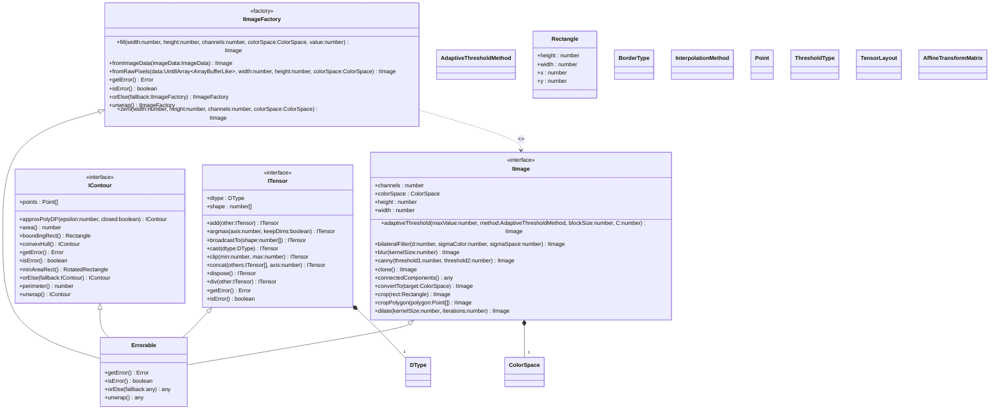

[**@ocrjs/infra-contract**](../README.md)

***

[@ocrjs/infra-contract](../README.md) / IImageFactory

# Interface: IImageFactory

Defined in: [interfaces/IImageFactory.ts:9](https://github.com/SotaTne/ocrjs/blob/0b7f8fd574ea61267d8c3b63c1f0e7b7bba13fe0/packages/infra-contract/src/interfaces/IImageFactory.ts#L9)

Factory interface for creating IImage instances.
Implementations provide concrete image creation logic.

## UML Class Diagram

## theme_extends

- [`Errorable`](../type-aliases/Errorable.md)\<`IImageFactory`\>

## Methods

### fill()

> **fill**(`width`, `height`, `channels`, `colorSpace`, `value`): [`IImage`](IImage.md)

Defined in: [interfaces/IImageFactory.ts:32](https://github.com/SotaTne/ocrjs/blob/0b7f8fd574ea61267d8c3b63c1f0e7b7bba13fe0/packages/infra-contract/src/interfaces/IImageFactory.ts#L32)

Creates an image filled with a specific value.

#### Parameters

##### width

`number`

Image width in pixels

##### height

`number`

Image height in pixels

##### channels

`number`

Number of channels

##### colorSpace

[`ColorSpace`](../type-aliases/ColorSpace.md)

Color space of the image

##### value

Fill value (single number for all channels, or array for per-channel)

`number` | readonly `number`[]

#### Returns

[`IImage`](IImage.md)

***

### fromImageData()

> **fromImageData**(`imageData`): [`IImage`](IImage.md)

Defined in: [interfaces/IImageFactory.ts:58](https://github.com/SotaTne/ocrjs/blob/0b7f8fd574ea61267d8c3b63c1f0e7b7bba13fe0/packages/infra-contract/src/interfaces/IImageFactory.ts#L58)

Creates an image from ImageData (Browser environment).

#### Parameters

##### imageData

`ImageData`

Browser ImageData object

#### Returns

[`IImage`](IImage.md)

***

### fromRawPixels()

> **fromRawPixels**(`data`, `width`, `height`, `colorSpace`): [`IImage`](IImage.md)

Defined in: [interfaces/IImageFactory.ts:47](https://github.com/SotaTne/ocrjs/blob/0b7f8fd574ea61267d8c3b63c1f0e7b7bba13fe0/packages/infra-contract/src/interfaces/IImageFactory.ts#L47)

Creates an image from raw pixel data.

#### Parameters

##### data

Raw pixel data (row-major order)

`Uint8Array`\<`ArrayBufferLike`\> | `Uint8ClampedArray`\<`ArrayBufferLike`\>

##### width

`number`

Image width in pixels

##### height

`number`

Image height in pixels

##### colorSpace

[`ColorSpace`](../type-aliases/ColorSpace.md)

Color space of the data

#### Returns

[`IImage`](IImage.md)

***

### getError()

> **getError**(): `Error` \| `null`

Defined in: [types/Errorable.ts:8](https://github.com/SotaTne/ocrjs/blob/0b7f8fd574ea61267d8c3b63c1f0e7b7bba13fe0/packages/infra-contract/src/types/Errorable.ts#L8)

#### Returns

`Error` \| `null`

#### Inherited from

[`Errorable`](../type-aliases/Errorable.md).[`getError`](../type-aliases/Errorable.md#geterror)

***

### isError()

> **isError**(): `boolean`

Defined in: [types/Errorable.ts:7](https://github.com/SotaTne/ocrjs/blob/0b7f8fd574ea61267d8c3b63c1f0e7b7bba13fe0/packages/infra-contract/src/types/Errorable.ts#L7)

#### Returns

`boolean`

#### Inherited from

[`Errorable`](../type-aliases/Errorable.md).[`isError`](../type-aliases/Errorable.md#iserror)

***

### orElse()

> **orElse**(`fallback`): `IImageFactory`

Defined in: [types/Errorable.ts:9](https://github.com/SotaTne/ocrjs/blob/0b7f8fd574ea61267d8c3b63c1f0e7b7bba13fe0/packages/infra-contract/src/types/Errorable.ts#L9)

#### Parameters

##### fallback

`IImageFactory`

#### Returns

`IImageFactory`

#### Inherited from

[`Errorable`](../type-aliases/Errorable.md).[`orElse`](../type-aliases/Errorable.md#orelse)

***

### unwrap()

> **unwrap**(): `IImageFactory`

Defined in: [types/Errorable.ts:10](https://github.com/SotaTne/ocrjs/blob/0b7f8fd574ea61267d8c3b63c1f0e7b7bba13fe0/packages/infra-contract/src/types/Errorable.ts#L10)

#### Returns

`IImageFactory`

#### Inherited from

[`Errorable`](../type-aliases/Errorable.md).[`unwrap`](../type-aliases/Errorable.md#unwrap)

***

### zero()

> **zero**(`width`, `height`, `channels`, `colorSpace`): [`IImage`](IImage.md)

Defined in: [interfaces/IImageFactory.ts:17](https://github.com/SotaTne/ocrjs/blob/0b7f8fd574ea61267d8c3b63c1f0e7b7bba13fe0/packages/infra-contract/src/interfaces/IImageFactory.ts#L17)

Creates a zero-filled image (black image).

#### Parameters

##### width

`number`

Image width in pixels

##### height

`number`

Image height in pixels

##### channels

`number`

Number of channels (1=grayscale, 3=RGB, 4=RGBA)

##### colorSpace

[`ColorSpace`](../type-aliases/ColorSpace.md)

Color space of the image

#### Returns

[`IImage`](IImage.md)
