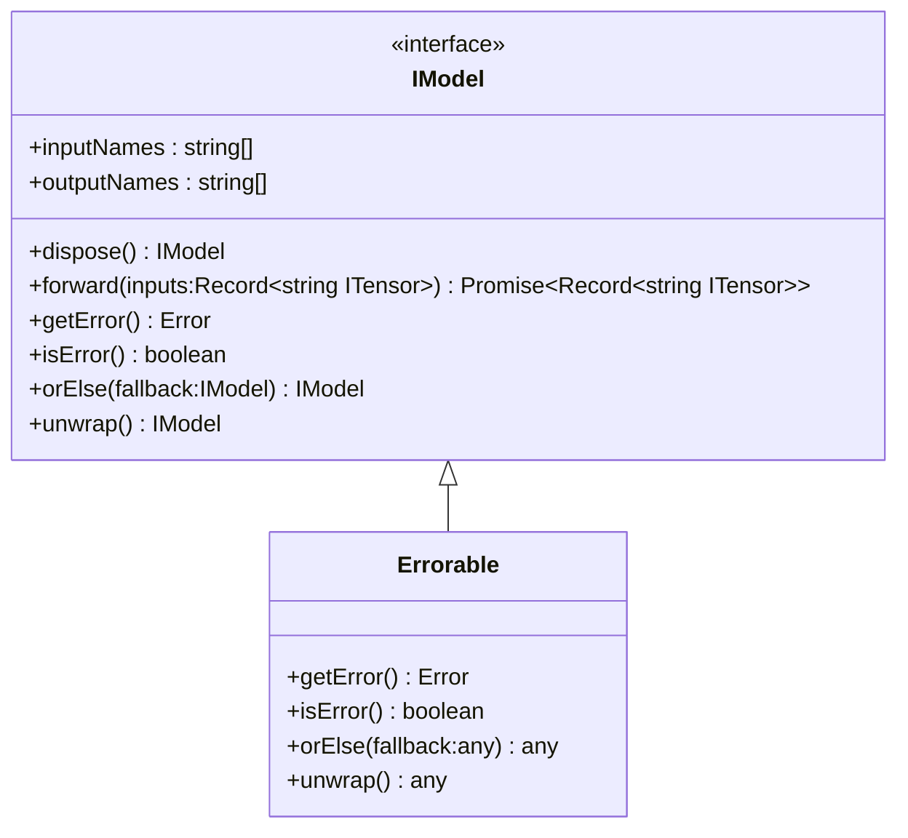

[**@ocrjs/infra-contract**](../README.md)

***

[@ocrjs/infra-contract](../README.md) / IModel

# Interface: IModel

Defined in: [interfaces/IModel.ts:21](https://github.com/SotaTne/ocrjs/blob/0b7f8fd574ea61267d8c3b63c1f0e7b7bba13fe0/packages/infra-contract/src/interfaces/IModel.ts#L21)

Model interface for framework-agnostic inference.
Can be implemented using ONNX Runtime, TensorFlow.js, or other frameworks.

This interface provides a unified API regardless of the underlying
inference framework, allowing engines to work with any model format.

## UML Class Diagram

## theme_extends

- [`Errorable`](../type-aliases/Errorable.md)\<`IModel`\>

## Properties

### inputNames

> `readonly` **inputNames**: readonly `string`[]

Defined in: [interfaces/IModel.ts:32](https://github.com/SotaTne/ocrjs/blob/0b7f8fd574ea61267d8c3b63c1f0e7b7bba13fe0/packages/infra-contract/src/interfaces/IModel.ts#L32)

Get input names expected by the model.

***

### outputNames

> `readonly` **outputNames**: readonly `string`[]

Defined in: [interfaces/IModel.ts:37](https://github.com/SotaTne/ocrjs/blob/0b7f8fd574ea61267d8c3b63c1f0e7b7bba13fe0/packages/infra-contract/src/interfaces/IModel.ts#L37)

Get output names provided by the model.

## Methods

### dispose()

> **dispose**(): `IModel`

Defined in: [interfaces/IModel.ts:42](https://github.com/SotaTne/ocrjs/blob/0b7f8fd574ea61267d8c3b63c1f0e7b7bba13fe0/packages/infra-contract/src/interfaces/IModel.ts#L42)

Clean up resources (model weights, session).

#### Returns

`IModel`

***

### forward()

> **forward**(`inputs`): `Promise`\<`Record`\<`string`, [`ITensor`](ITensor.md)\>\>

Defined in: [interfaces/IModel.ts:27](https://github.com/SotaTne/ocrjs/blob/0b7f8fd574ea61267d8c3b63c1f0e7b7bba13fe0/packages/infra-contract/src/interfaces/IModel.ts#L27)

Run inference with the model.

#### Parameters

##### inputs

`Record`\<`string`, [`ITensor`](ITensor.md)\>

Input tensors mapped by name

#### Returns

`Promise`\<`Record`\<`string`, [`ITensor`](ITensor.md)\>\>

Output tensors mapped by name

***

### getError()

> **getError**(): `Error` \| `null`

Defined in: [types/Errorable.ts:8](https://github.com/SotaTne/ocrjs/blob/0b7f8fd574ea61267d8c3b63c1f0e7b7bba13fe0/packages/infra-contract/src/types/Errorable.ts#L8)

#### Returns

`Error` \| `null`

#### Inherited from

[`Errorable`](../type-aliases/Errorable.md).[`getError`](../type-aliases/Errorable.md#geterror)

***

### isError()

> **isError**(): `boolean`

Defined in: [types/Errorable.ts:7](https://github.com/SotaTne/ocrjs/blob/0b7f8fd574ea61267d8c3b63c1f0e7b7bba13fe0/packages/infra-contract/src/types/Errorable.ts#L7)

#### Returns

`boolean`

#### Inherited from

[`Errorable`](../type-aliases/Errorable.md).[`isError`](../type-aliases/Errorable.md#iserror)

***

### orElse()

> **orElse**(`fallback`): `IModel`

Defined in: [types/Errorable.ts:9](https://github.com/SotaTne/ocrjs/blob/0b7f8fd574ea61267d8c3b63c1f0e7b7bba13fe0/packages/infra-contract/src/types/Errorable.ts#L9)

#### Parameters

##### fallback

`IModel`

#### Returns

`IModel`

#### Inherited from

[`Errorable`](../type-aliases/Errorable.md).[`orElse`](../type-aliases/Errorable.md#orelse)

***

### unwrap()

> **unwrap**(): `IModel`

Defined in: [types/Errorable.ts:10](https://github.com/SotaTne/ocrjs/blob/0b7f8fd574ea61267d8c3b63c1f0e7b7bba13fe0/packages/infra-contract/src/types/Errorable.ts#L10)

#### Returns

`IModel`

#### Inherited from

[`Errorable`](../type-aliases/Errorable.md).[`unwrap`](../type-aliases/Errorable.md#unwrap)
