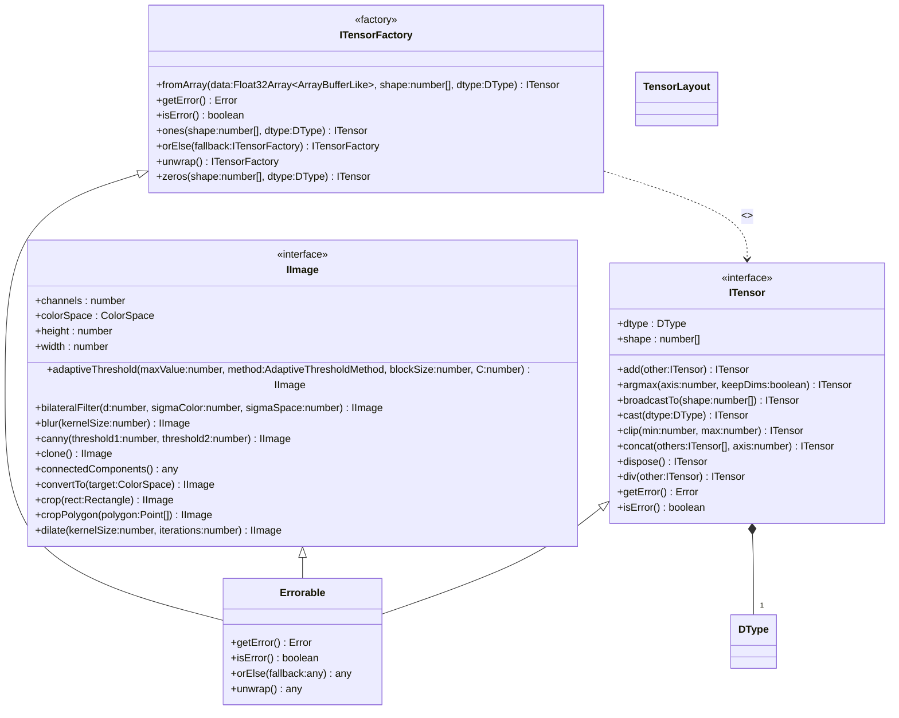

[**@ocrjs/infra-contract**](../README.md)

***

[@ocrjs/infra-contract](../README.md) / ITensorFactory

# Interface: ITensorFactory

Defined in: [interfaces/ITensorFactory.ts:9](https://github.com/SotaTne/ocrjs/blob/0b7f8fd574ea61267d8c3b63c1f0e7b7bba13fe0/packages/infra-contract/src/interfaces/ITensorFactory.ts#L9)

Factory interface for creating ITensor instances.
Implementations provide concrete tensor creation logic.

## UML Class Diagram

## theme_extends

- [`Errorable`](../type-aliases/Errorable.md)\<`ITensorFactory`\>

## Methods

### fromArray()

> **fromArray**(`data`, `shape`, `dtype`): [`ITensor`](ITensor.md)

Defined in: [interfaces/ITensorFactory.ts:30](https://github.com/SotaTne/ocrjs/blob/0b7f8fd574ea61267d8c3b63c1f0e7b7bba13fe0/packages/infra-contract/src/interfaces/ITensorFactory.ts#L30)

Creates a tensor from an array of data.

#### Parameters

##### data

Source data array

`Float32Array`\<`ArrayBufferLike`\> | `Int32Array`\<`ArrayBufferLike`\> | `Float16Array`\<`ArrayBufferLike`\> | `Int8Array`\<`ArrayBufferLike`\> | `Uint8Array`\<`ArrayBufferLike`\> | `Uint8ClampedArray`\<`ArrayBufferLike`\> | `number`[]

##### shape

readonly `number`[]

Tensor shape (must match data length)

##### dtype

[`DType`](../type-aliases/DType.md)

Data type

#### Returns

[`ITensor`](ITensor.md)

***

### getError()

> **getError**(): `Error` \| `null`

Defined in: [types/Errorable.ts:8](https://github.com/SotaTne/ocrjs/blob/0b7f8fd574ea61267d8c3b63c1f0e7b7bba13fe0/packages/infra-contract/src/types/Errorable.ts#L8)

#### Returns

`Error` \| `null`

#### Inherited from

[`Errorable`](../type-aliases/Errorable.md).[`getError`](../type-aliases/Errorable.md#geterror)

***

### isError()

> **isError**(): `boolean`

Defined in: [types/Errorable.ts:7](https://github.com/SotaTne/ocrjs/blob/0b7f8fd574ea61267d8c3b63c1f0e7b7bba13fe0/packages/infra-contract/src/types/Errorable.ts#L7)

#### Returns

`boolean`

#### Inherited from

[`Errorable`](../type-aliases/Errorable.md).[`isError`](../type-aliases/Errorable.md#iserror)

***

### ones()

> **ones**(`shape`, `dtype`): [`ITensor`](ITensor.md)

Defined in: [interfaces/ITensorFactory.ts:22](https://github.com/SotaTne/ocrjs/blob/0b7f8fd574ea61267d8c3b63c1f0e7b7bba13fe0/packages/infra-contract/src/interfaces/ITensorFactory.ts#L22)

Creates a tensor filled with ones.

#### Parameters

##### shape

readonly `number`[]

Tensor shape

##### dtype

[`DType`](../type-aliases/DType.md)

Data type

#### Returns

[`ITensor`](ITensor.md)

***

### orElse()

> **orElse**(`fallback`): `ITensorFactory`

Defined in: [types/Errorable.ts:9](https://github.com/SotaTne/ocrjs/blob/0b7f8fd574ea61267d8c3b63c1f0e7b7bba13fe0/packages/infra-contract/src/types/Errorable.ts#L9)

#### Parameters

##### fallback

`ITensorFactory`

#### Returns

`ITensorFactory`

#### Inherited from

[`Errorable`](../type-aliases/Errorable.md).[`orElse`](../type-aliases/Errorable.md#orelse)

***

### unwrap()

> **unwrap**(): `ITensorFactory`

Defined in: [types/Errorable.ts:10](https://github.com/SotaTne/ocrjs/blob/0b7f8fd574ea61267d8c3b63c1f0e7b7bba13fe0/packages/infra-contract/src/types/Errorable.ts#L10)

#### Returns

`ITensorFactory`

#### Inherited from

[`Errorable`](../type-aliases/Errorable.md).[`unwrap`](../type-aliases/Errorable.md#unwrap)

***

### zeros()

> **zeros**(`shape`, `dtype`): [`ITensor`](ITensor.md)

Defined in: [interfaces/ITensorFactory.ts:15](https://github.com/SotaTne/ocrjs/blob/0b7f8fd574ea61267d8c3b63c1f0e7b7bba13fe0/packages/infra-contract/src/interfaces/ITensorFactory.ts#L15)

Creates a tensor filled with zeros.

#### Parameters

##### shape

readonly `number`[]

Tensor shape

##### dtype

[`DType`](../type-aliases/DType.md)

Data type

#### Returns

[`ITensor`](ITensor.md)
