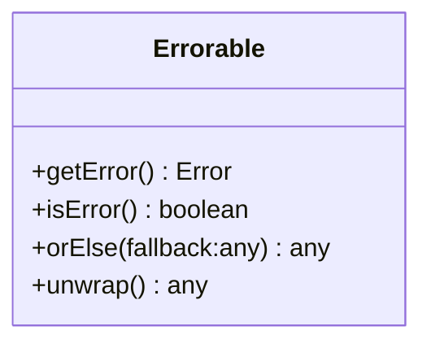

[**@ocrjs/infra-contract**](../README.md)

***

[@ocrjs/infra-contract](../README.md) / Errorable

# Type Alias: Errorable\<T\>

> **Errorable**\<`T`\> = `object`

Defined in: [types/Errorable.ts:6](https://github.com/SotaTne/ocrjs/blob/0b7f8fd574ea61267d8c3b63c1f0e7b7bba13fe0/packages/infra-contract/src/types/Errorable.ts#L6)

Represents a value that may either be a valid result of type T or an Error.
Provides methods to check for errors and to safely unwrap the value.

## UML Class Diagram

## theme_extended_by

- [`IContour`](../interfaces/IContour.md)
- [`IGeometryPolygon`](../interfaces/IGeometryPolygon.md)
- [`IGeometryPolygonFactory`](../interfaces/IGeometryPolygonFactory.md)
- [`IImage`](../interfaces/IImage.md)
- [`IImageFactory`](../interfaces/IImageFactory.md)
- [`IModel`](../interfaces/IModel.md)
- [`IModelLoader`](../interfaces/IModelLoader.md)
- [`ITensor`](../interfaces/ITensor.md)
- [`ITensorFactory`](../interfaces/ITensorFactory.md)

## Type Parameters

### T

`T`

The type of the valid result

## Methods

### getError()

> **getError**(): `Error` \| `null`

Defined in: [types/Errorable.ts:8](https://github.com/SotaTne/ocrjs/blob/0b7f8fd574ea61267d8c3b63c1f0e7b7bba13fe0/packages/infra-contract/src/types/Errorable.ts#L8)

#### Returns

`Error` \| `null`

***

### isError()

> **isError**(): `boolean`

Defined in: [types/Errorable.ts:7](https://github.com/SotaTne/ocrjs/blob/0b7f8fd574ea61267d8c3b63c1f0e7b7bba13fe0/packages/infra-contract/src/types/Errorable.ts#L7)

#### Returns

`boolean`

***

### orElse()

> **orElse**(`fallback`): `T`

Defined in: [types/Errorable.ts:9](https://github.com/SotaTne/ocrjs/blob/0b7f8fd574ea61267d8c3b63c1f0e7b7bba13fe0/packages/infra-contract/src/types/Errorable.ts#L9)

#### Parameters

##### fallback

`T`

#### Returns

`T`

***

### unwrap()

> **unwrap**(): `T`

Defined in: [types/Errorable.ts:10](https://github.com/SotaTne/ocrjs/blob/0b7f8fd574ea61267d8c3b63c1f0e7b7bba13fe0/packages/infra-contract/src/types/Errorable.ts#L10)

#### Returns

`T`
