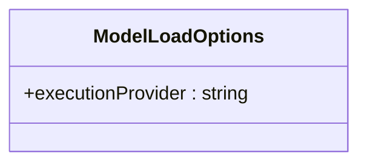

[**@ocrjs/infra-contract**](../README.md)

***

[@ocrjs/infra-contract](../README.md) / ModelLoadOptions

# Type Alias: ModelLoadOptions

> **ModelLoadOptions** = `object`

Defined in: [interfaces/IModel.ts:7](https://github.com/SotaTne/ocrjs/blob/0b7f8fd574ea61267d8c3b63c1f0e7b7bba13fe0/packages/infra-contract/src/interfaces/IModel.ts#L7)

Options for loading a model.

## UML Class Diagram

## Indexable

\[`key`: `string`\]: `unknown`

Additional framework-specific options

## Properties

### executionProvider?

> `optional` **executionProvider**: `string`

Defined in: [interfaces/IModel.ts:9](https://github.com/SotaTne/ocrjs/blob/0b7f8fd574ea61267d8c3b63c1f0e7b7bba13fe0/packages/infra-contract/src/interfaces/IModel.ts#L9)

Execution provider preference (e.g., 'cpu', 'webgpu', 'wasm')
