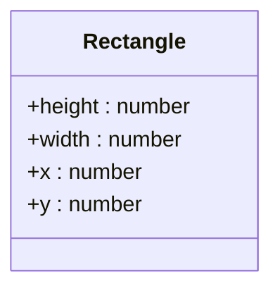

[**@ocrjs/infra-contract**](../README.md)

***

[@ocrjs/infra-contract](../README.md) / Rectangle

# Type Alias: Rectangle

> **Rectangle** = `object`

Defined in: [types/CommonTypes.ts:61](https://github.com/SotaTne/ocrjs/blob/0b7f8fd574ea61267d8c3b63c1f0e7b7bba13fe0/packages/infra-contract/src/types/CommonTypes.ts#L61)

Axis-aligned rectangle.

## UML Class Diagram

## Properties

### height

> **height**: `number`

Defined in: [types/CommonTypes.ts:65](https://github.com/SotaTne/ocrjs/blob/0b7f8fd574ea61267d8c3b63c1f0e7b7bba13fe0/packages/infra-contract/src/types/CommonTypes.ts#L65)

***

### width

> **width**: `number`

Defined in: [types/CommonTypes.ts:64](https://github.com/SotaTne/ocrjs/blob/0b7f8fd574ea61267d8c3b63c1f0e7b7bba13fe0/packages/infra-contract/src/types/CommonTypes.ts#L64)

***

### x

> **x**: `number`

Defined in: [types/CommonTypes.ts:62](https://github.com/SotaTne/ocrjs/blob/0b7f8fd574ea61267d8c3b63c1f0e7b7bba13fe0/packages/infra-contract/src/types/CommonTypes.ts#L62)

***

### y

> **y**: `number`

Defined in: [types/CommonTypes.ts:63](https://github.com/SotaTne/ocrjs/blob/0b7f8fd574ea61267d8c3b63c1f0e7b7bba13fe0/packages/infra-contract/src/types/CommonTypes.ts#L63)
