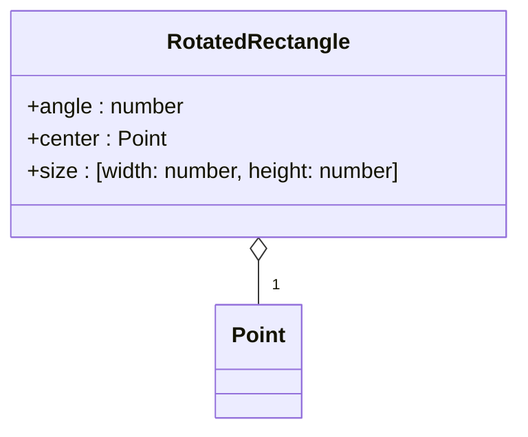

[**@ocrjs/infra-contract**](../README.md)

***

[@ocrjs/infra-contract](../README.md) / RotatedRectangle

# Type Alias: RotatedRectangle

> **RotatedRectangle** = `object`

Defined in: [types/CommonTypes.ts:71](https://github.com/SotaTne/ocrjs/blob/0b7f8fd574ea61267d8c3b63c1f0e7b7bba13fe0/packages/infra-contract/src/types/CommonTypes.ts#L71)

Rotated rectangle with center, size, and angle.

## UML Class Diagram

## Properties

### angle

> **angle**: `number`

Defined in: [types/CommonTypes.ts:74](https://github.com/SotaTne/ocrjs/blob/0b7f8fd574ea61267d8c3b63c1f0e7b7bba13fe0/packages/infra-contract/src/types/CommonTypes.ts#L74)

***

### center

> **center**: [`Point`](Point.md)

Defined in: [types/CommonTypes.ts:72](https://github.com/SotaTne/ocrjs/blob/0b7f8fd574ea61267d8c3b63c1f0e7b7bba13fe0/packages/infra-contract/src/types/CommonTypes.ts#L72)

***

### size

> **size**: \[`number`, `number`\]

Defined in: [types/CommonTypes.ts:73](https://github.com/SotaTne/ocrjs/blob/0b7f8fd574ea61267d8c3b63c1f0e7b7bba13fe0/packages/infra-contract/src/types/CommonTypes.ts#L73)
