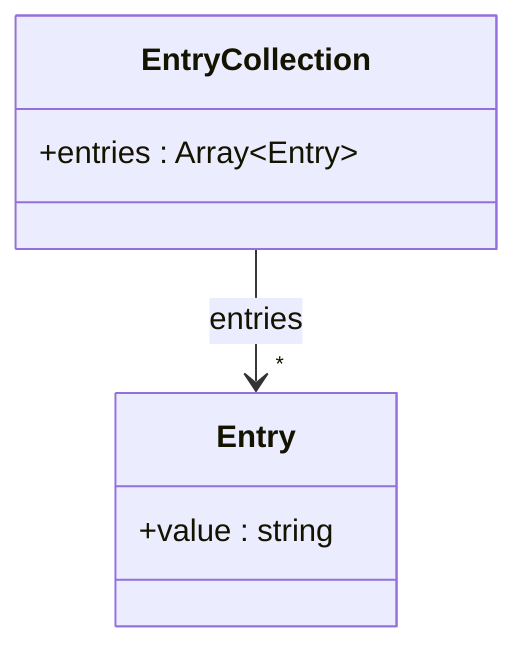

```mermaid
classDiagram
class uml_EntryCollection["EntryCollection"] {
  +entries : Array&lt;Entry&gt;
}
class uml_Entry["Entry"] {
  +value : string
}

uml_EntryCollection --> "*" uml_Entry : entries

click uml_EntryCollection href "../README.md" "EntryCollection"
click uml_Entry href "../README.md" "Entry"
```
