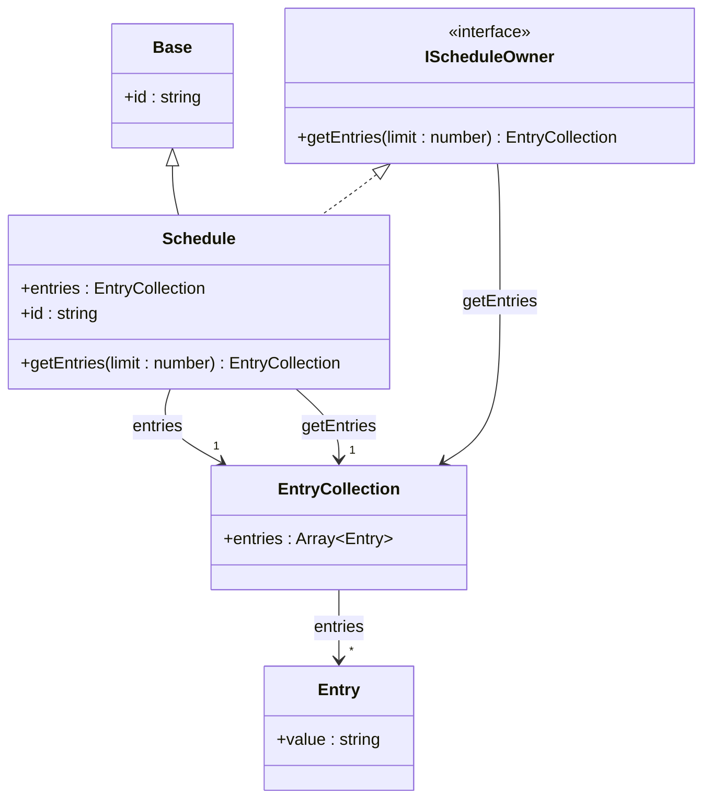

```mermaid
classDiagram
class uml_Schedule["Schedule"] {
  +entries : EntryCollection
  +id : string
  +getEntries(limit : number) EntryCollection
}
class uml_Base["Base"] {
  +id : string
}
class uml_IScheduleOwner["IScheduleOwner"] {
  <<interface>>
  +getEntries(limit : number) EntryCollection
}
class uml_EntryCollection["EntryCollection"] {
  +entries : Array&lt;Entry&gt;
}
class uml_Entry["Entry"] {
  +value : string
}

uml_Base <|-- uml_Schedule
uml_IScheduleOwner <|.. uml_Schedule
uml_Schedule --> "1" uml_EntryCollection : entries
uml_Schedule --> "1" uml_EntryCollection : getEntries
uml_IScheduleOwner --> "1" uml_EntryCollection : getEntries
uml_EntryCollection --> "*" uml_Entry : entries

click uml_Schedule href "Schedule.md" "Schedule"
click uml_Base href "Base.md" "Base"
click uml_IScheduleOwner href "../interfaces/IScheduleOwner.md" "IScheduleOwner"
click uml_EntryCollection href "EntryCollection.md" "EntryCollection"
click uml_Entry href "Entry.md" "Entry"
```