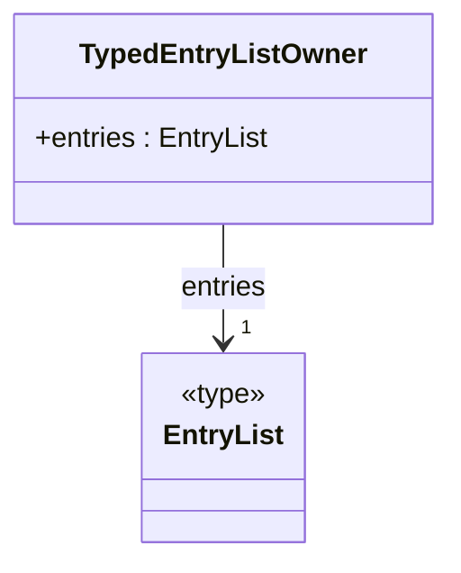

```mermaid
classDiagram
class uml_TypedEntryListOwner["TypedEntryListOwner"] {
  +entries : EntryList
}
class uml_EntryList["EntryList"] {
  <<type>>
}

uml_TypedEntryListOwner --> "1" uml_EntryList : entries

click uml_TypedEntryListOwner href "TypedEntryListOwner.md" "TypedEntryListOwner"
click uml_EntryList href "../type-aliases/EntryList.md" "EntryList"
```