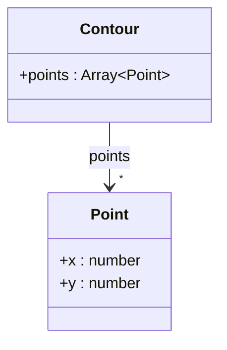

```mermaid
classDiagram
class uml_Contour["Contour"] {
  +points : Array&lt;Point&gt;
}
class uml_Point["Point"] {
  +x : number
  +y : number
}

uml_Contour --> "*" uml_Point : points

click uml_Contour href "Contour.md" "Contour"
click uml_Point href "../README.md" "Point"
```