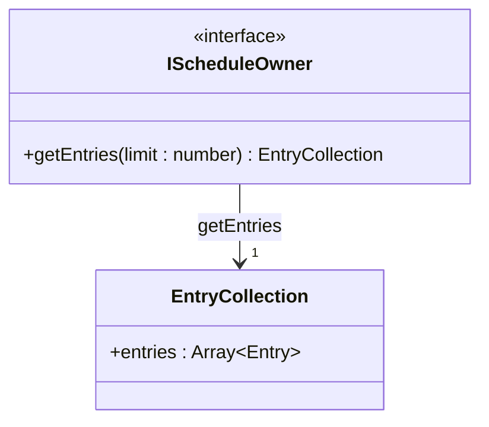

```mermaid
classDiagram
class uml_IScheduleOwner["IScheduleOwner"] {
  <<interface>>
  +getEntries(limit : number) EntryCollection
}
class uml_EntryCollection["EntryCollection"] {
  +entries : Array&lt;Entry&gt;
}

uml_IScheduleOwner --> "1" uml_EntryCollection : getEntries

click uml_IScheduleOwner href "../README.md" "IScheduleOwner"
click uml_EntryCollection href "../README.md" "EntryCollection"
```
