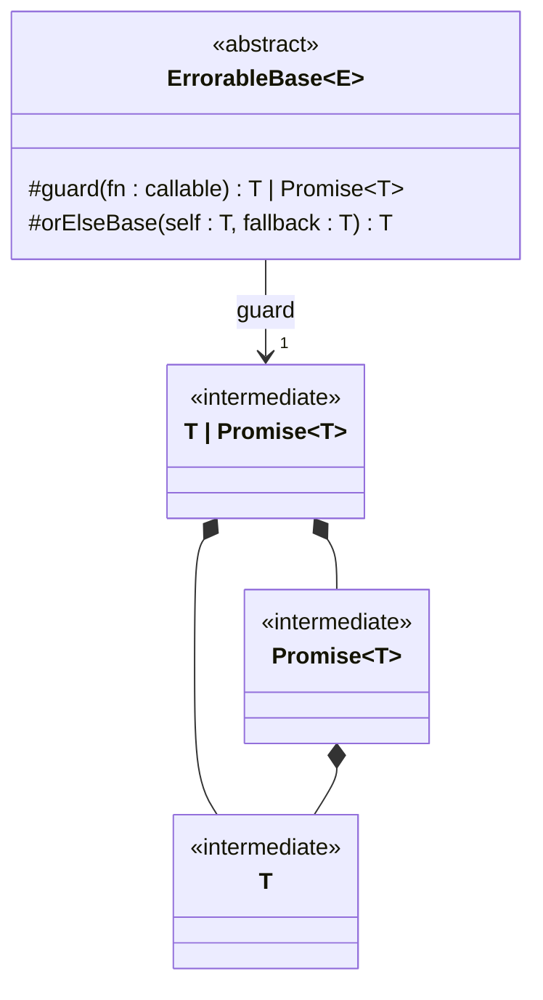

```mermaid
classDiagram
class uml_ErrorableBase_E_["ErrorableBase&lt;E&gt;"] {
  <<abstract>>
  #guard<T>(fn : callable) T | Promise&lt;T&gt;
  #orElseBase<T>(self : T, fallback : T) T
}
class uml_T___Promise_T_["T | Promise&lt;T&gt;"] {
  <<intermediate>>
}
class uml_T["T"] {
  <<intermediate>>
}
class uml_Promise_T_["Promise&lt;T&gt;"] {
  <<intermediate>>
}

uml_ErrorableBase_E_ --> "1" uml_T___Promise_T_ : guard
uml_T___Promise_T_ *-- uml_T
uml_T___Promise_T_ *-- uml_Promise_T_
uml_Promise_T_ *-- uml_T

click uml_ErrorableBase_E_ href "../README.md" "ErrorableBase&lt;E&gt;"
```
