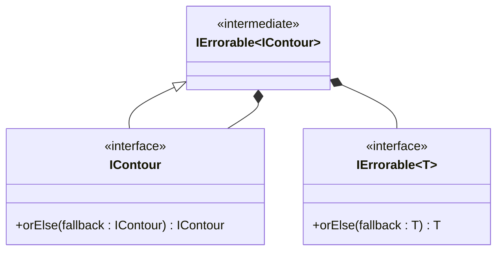

```mermaid
classDiagram
class uml_IContour["IContour"] {
  <<interface>>
  +orElse(fallback : IContour) IContour
}
class uml_IErrorable_T_["IErrorable&lt;T&gt;"] {
  <<interface>>
  +orElse(fallback : T) T
}
class uml_IErrorable_IContour_["IErrorable&lt;IContour&gt;"] {
  <<intermediate>>
}

uml_IErrorable_IContour_ <|-- uml_IContour
uml_IErrorable_IContour_ *-- uml_IErrorable_T_
uml_IErrorable_IContour_ *-- uml_IContour

click uml_IContour href "IContour.md" "IContour"
click uml_IErrorable_T_ href "../README.md" "IErrorable&lt;T&gt;"
```