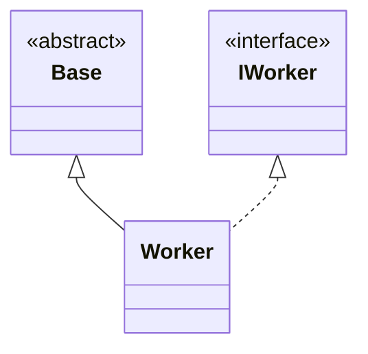

```mermaid
classDiagram
class uml_Worker["Worker"] {
}
class uml_Base["Base"] {
  <<abstract>>
}
class uml_IWorker["IWorker"] {
  <<interface>>
}

uml_Base <|-- uml_Worker
uml_IWorker <|.. uml_Worker

click uml_Worker href "Worker.md" "Worker"
click uml_Base href "Base.md" "Base"
click uml_IWorker href "../README.md" "IWorker"
```